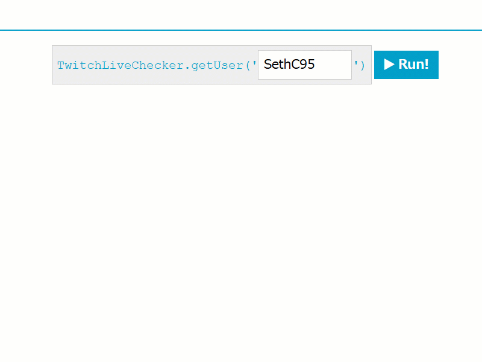

# Twitch Live Checker
Twitch Live Checker is a helper function for checking if a user is streaming live on Twitch or not. You can view a demo of it in action [here](https://sethclydesdale.github.io/twitch-live-checker/).



-----

**Quick Links**
- [How to Install](#how-to-install)
- [How to Use](#how-to-use)
- [Preset Embed Codes](#preset-embed-codes)
- [TwitchLiveChecker Documentation](#twitchlivechecker-documentation)

### How to Install

Simply include [**twitch-live-checker.js**](https://github.com/SethClydesdale/twitch-live-checker/blob/main/twitch-live-checker.js) in the `<head>` section of your website and you're good to go!


### How to Use

Using Twitch Live Checker is fairly straightforward just like the installation. The basic usage looks like this:

```javascript
TwitchLiveChecker.getUser('NAME', function (status) {
  if (status == 'online') {
    // do something if NAME is streaming live
  } else {
    // do something if NAME is NOT streaming
  }
});
```
Simply replace `NAME` with your username or your favorite streamer to get their current streaming status.


**NOTE:** If using TwitchLiveChecker during page load, it is HIGHLY recommended to wrap the function in a `window.onload` event handler to prevent impact to your page loading speed:

```javascript
window.addEventListener('load', function () {
  TwitchLiveChecker.getUser('NAME', function (status) {
    if (status == 'online') {
      // do something if NAME is streaming live
    } else {
      // do something if NAME is NOT streaming
    }
  });
});
```

### Preset Embed Codes

Below are some preset codes that you can copy and use on your website to embed your stream, a notification, etc.

- [Embed Your Twitch Stream Only When You're Live](#embed-your-twitch-stream-only-when-youre-live)
- [Show a Notifcation Whenever You Go Live on Twitch](#show-a-notifcation-whenever-you-go-live-on-twitch)


#### Embed Your Twitch Stream Only When You're Live
Copy the code below to where you want to show your livestream whenever you go live. Simply replace `NAME` with your Twitch username and you're all set! You can also customize the options for the frame, below the `name` variable. Please see Twitch's documentation for the embed options [here](https://dev.twitch.tv/docs/embed/everything/#embed-parameters).

You can also edit the `offlineMessage` message variable if you want to change the message or remove it completely. To remove it completely, simply leave it blank, like this: `offlineMessage = ''`. The special `${USERNAME}` variable can be used in your message to place your name wherever you like in it. This name is the same name you input into the `name` variable.
```html
<div id="myLiveStream"></div>
<script>window.addEventListener('load', function () {
  var name = 'NAME',
      offlineMessage = '<span id="myLiveStream_text"><a href="https://www.twitch.tv/${USERNAME}" target="_blank">${USERNAME}</a> is currently offline.</span>',
      options = {
        height: 191,
        width: 340,
        channel: name,
        muted: false,
        autoplay: true,
        allowfullscreen : true,
        parent: [window.location.host]
      };
  
  TwitchLiveChecker.getUser(name, function (status) {
    if (status == 'online') {
      var player = new Twitch.Player('myLiveStream', options);
                             
    } else {
      document.getElementById('myLiveStream').innerHTML = offlineMessage.replace(/\$\{USERNAME\}/g, name);
    }
  });
});</script>
```
**NOTE:** If you're applying this code after page load, you can remove the `window.addEventListener` wrapper function.


#### Show a Notifcation Whenever You Go Live on Twitch
Copy this code to wherever you want to show a notification when you're live on twitch. Replace `NAME` with your Twitch username. After this, you can modify the `onlineMessage` and `offlineMessage` variables to change the message that is displayed. If you only want to show a message when you're live, simply leave `offlineMessage` blank like this: `offlineMessage = ''`. You can use the special `${USERNAME}` variable in these messages to put your name wherever you like.
```html
<div id="myStreamNotif"></div>
<script>window.addEventListener('load', function () {
  var name = 'NAME',
      onlineMessage = '${USERNAME} is currently live on Twitch! <a href="https://www.twitch.tv/${USERNAME}" target="_blank">Come stop by!</a>',
      offlineMessage = '${USERNAME} is currently offline. Please check back later!';
  
  TwitchLiveChecker.getUser(name, function (status) {
    document.getElementById('myStreamNotif').innerHTML = (status == 'online' ? onlineMessage : offlineMessage).replace(/\$\{USERNAME\}/g, name);
  });
});</script>
```
**NOTE:** If you're applying this code after page load, you can remove the `window.addEventListener` wrapper function.


### TwitchLiveChecker Documentation

TwitchLiveChecker contains two methods `getUser()` for getting the streaming status of a user and `getAPI()` which is handled inside of `getUser()` for getting the Twitch embed API if it's not already loaded. All we need to know is how to use `getUser()`, so see the section below for more information.

#### getUser(name, callback)

Gets the streaming status of a user on https://www.twitch.tv/

##### Example
```javascript
TwitchLiveChecker.getUser('SethC95', function (status) {
  alert('SethC95 is ' + status + '.');
});
```

##### Syntax
```javascript
TwitchLiveChecker.getUser('name', function (status) { ... }); 
```

##### Parameters
| Parameter | type | Description |
| :-------- | :--- | :---------- |
| **name** | `string` | The name of the channel you want to check the status of (e.g. "sethc95" from www.twitch.tv/sethc95). |
| **callback** | `function` | The function to be executed when the status is received. |
| **status** | `string` | Parameter for the **callback** function. Returns a string containing either "online" or "offline" depending on the user's streaming status. |
